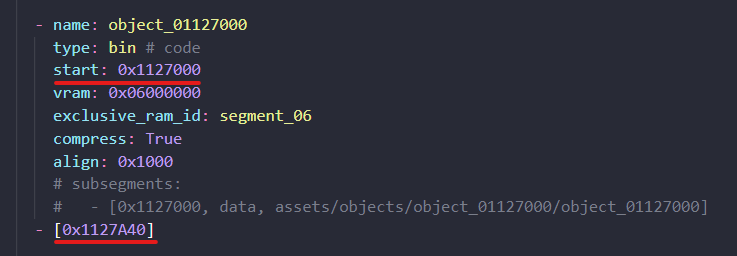
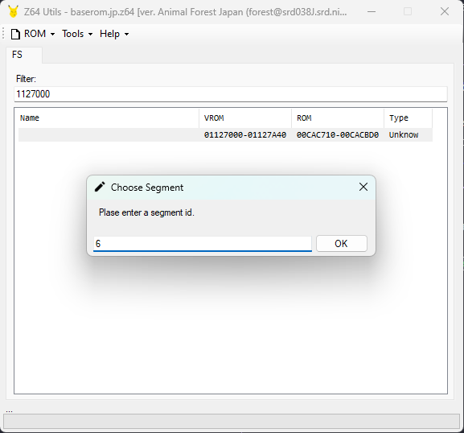
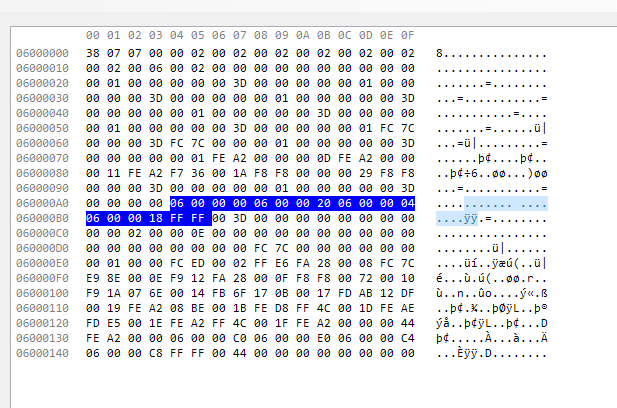
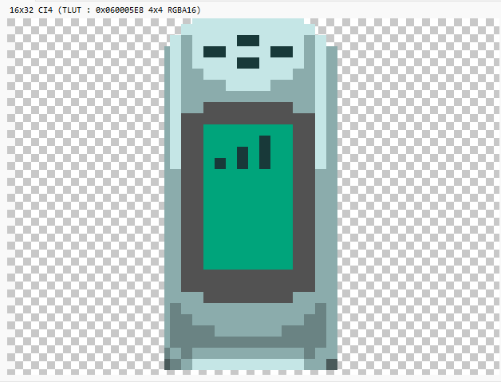
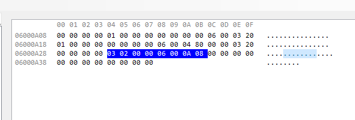

# Asset Extraction

## What are Objects

Similar to overlays, due to the N64's small amount of memory graphical assets need to be loaded and unloaded depending on what is currently happening in the game. This is accomplished using objects, which are bundles of data with no header or other identifying information.

They consist of various things such as:
- Vertices: 3D coordinates used to assemble a 3d mesh.
- Textures: A 2D image that gets mapped to the triangles of a mesh.
- Palettes: A list of colors used as a look up table for palette textures.
- Display Lists: Graphical commands that get sent to the N64's Reality Co-Processer to render the object.
- c_keyframe Data: Used for skeletal animations.
- evw_anime Data: Used for texture animations.

Objects can be loaded into an arbitrary spot in ram. They are referenced with something called a segment address, which is a feature of the N64's RSP. There are are 16 segments an object can use, with the first byte indicating which segment. Most objects use segment 6, or address that look like 0x06XXXXXX

## Setting Up the Script

The data inside objects needs to be defined in multiple places in the repo. To make things less tedious, I wrote a script to automate a lot of it.

Download script.py from here: https://github.com/emilybrooks/af_asset_script

First you need to edit the `projectDir` variable to where your `af` folder is. You also need to make `input.csv` in the same folder as `script.py`. This is where we will record all the information about the object's data.

## Filling out input.csv

The first row of the csv file has:
- ROM start address
- ROM end address
- Segment number
- Object name
- Directory where files will be extracted to
- (Optional) Sub folder, for objects that contain sub objects.

For this tutorial I will be extracting tol_keitai_1. It's ROM address is 0x1127000, and the ROM end address can be found in assets.yaml



The first line of input.csv should look like this:

```csv
0x1127000, 0x1127A40, 6, tol_keitai_1, objects/tol_keitai_1
```

Note: The directory actually refers to two places. Code files will use `af/src` as the start, and assets will use `af/assets/jp` as the start. So the .c and .h files will be placed in `af/src/objects/tol_keitai_1`, and extracted assets will be placed in `af/assets/jp/objects/tol_keitai_1`

The next step of extracting objects is to document exactly what data it contains. One important tool we will use is the linker map from DnM+, which lists out the names of all the pieces of data.

Searching for `tol_keitai` brings up these lines:
```
005a8120 000003 005a8120  4 cKF_ckcb_r_tol_keitai_1_keitai_off1_tbl 	dataobject.obj 
005a8124 000012 005a8124  4 cKF_kn_tol_keitai_1_keitai_off1_tbl 	dataobject.obj 
005a8138 000006 005a8138  4 cKF_c_tol_keitai_1_keitai_off1_tbl 	dataobject.obj 
005a8140 000084 005a8140  4 cKF_ds_tol_keitai_1_keitai_off1_tbl 	dataobject.obj 
005a81c4 000014 005a81c4  4 cKF_ba_r_tol_keitai_1_keitai_off1 	dataobject.obj 
005a81d8 000088 005a81d8  1 .data 	dataobject.obj 
005a81d8 000000 005a81d8 ...data.0 (entry of .data) 	dataobject.obj 
005a81d8 000003 005a81d8  4 cKF_ckcb_r_tol_keitai_1_keitai_on1_tbl 	dataobject.obj 
005a81dc 000002 005a81dc  4 cKF_kn_tol_keitai_1_keitai_on1_tbl 	dataobject.obj 
005a81e0 000016 005a81e0  4 cKF_c_tol_keitai_1_keitai_on1_tbl 	dataobject.obj 
005a81f8 000054 005a81f8  4 cKF_ds_tol_keitai_1_keitai_on1_tbl 	dataobject.obj 
005a824c 000014 005a824c  4 cKF_ba_r_tol_keitai_1_keitai_on1 	dataobject.obj 
005a8260 000740 005a8260  1 .data 	dataobject.obj 
005a8260 000000 005a8260 ...data.0 (entry of .data) 	dataobject.obj 
005a8260 000020 005a8260 32 tol_keitai_1_pal 	dataobject.obj 
005a8280 000100 005a8280 32 tol_keitai_1_ueura1_tex_txt 	dataobject.obj 
005a8380 000100 005a8380 32 tol_keitai_1_ueomote1_tex_txt 	dataobject.obj 
005a8480 000100 005a8480 32 tol_keitai_1_shitaura1_tex_txt 	dataobject.obj 
005a8580 000100 005a8580 32 tol_keitai_1_shitaomote1_tex_txt 	dataobject.obj 
005a8680 0001d0 005a8680  8 tol_keitai_1_v 	dataobject.obj 
005a8850 000088 005a8850  8 main1_keitai1_model 	dataobject.obj 
005a88d8 000088 005a88d8  8 main2_keitai1_model 	dataobject.obj 
005a8960 000024 005a8960  4 cKF_je_r_tol_keitai_1_tbl 	dataobject.obj 
005a8984 000008 005a8984  4 cKF_bs_r_tol_keitai_1 	dataobject.obj 
```

We will also use a program called Z64Utils. Currently it doesn't have full support for Animal Forest yet, but a modified build with partial functionality is pinned in the `#af_decomp` channel of our discord.

First load a ROM by going to ROM > Open. `af/baserom.jp.z64` or `af/baserom-decompressed.jp.z64` are fine.

In the filter field at the top put the object's rom start address (1127000), and click the entry that shows up. For the segment id, enter 6 and click OK.



This will open a new window with the object data.


The very first section of data is marked as Unknown. Referencing the linker map, this object has two animations, `keitai_off1` and `keitai_on1`. This is animation data, which Z64Utils currently doesn't support yet. But we can still read the hexadecimal data and figure it out ourselves. For these, you want to find the BaseAnimationR data, which will have pointers to all the other pieces of data. It will be four segment addresses (06XXXXXX) in a row. 



In this case, `cKF_ba_r_tol_keitai_1_keitai_off1` is at 0x060000A4, and has pointers to 0x06000000, 0x06000020, 0x06000004, and 0x06000018. You can reference the BaseAnimationR struct in c_keyframe.h and see that these are pointers to the ckcb, ds, kn, and c files respectively. 

Let's add this to `input.csv`. For each item you put the segment address, the filename, and the splat segment type. c_keyframe animation uses  `ckf_ckcb`, `ckf_ds`, `ckf_kn`, `ckf_c`, and `ckf_ba` types.

```csv
0x1127000, 0x1127A40, 6, tol_keitai_1, objects/tol_keitai_1
0x06000000, cKF_ckcb_r_tol_keitai_1_keitai_off1_tbl, ckf_ckcb
0x06000004, cKF_kn_tol_keitai_1_keitai_off1_tbl, ckf_kn
0x06000018, cKF_c_tol_keitai_1_keitai_off1_tbl, ckf_c
0x06000020, cKF_ds_tol_keitai_1_keitai_off1_tbl, ckf_ds
0x060000A4, cKF_ba_r_tol_keitai_1_keitai_off1, ckf_ba
```

The steps to add the second animation, `keitai_on1`, are the same.

The next piece of data is the vertices. Note that there are multiple groups of vertices in Z64Utils. When a display list references a specific set of vertices, Z64Utils will make that into it's own entry. However, These should only be a single array of vertices, `tol_keitai_1_v`. So grab the first Vertex section's address, which for this object is 0x06000150. These use the `vtx` type.

The next two sections are display lists, which Z64Utils was correctly able to identify. They are at 0x06000320 and 0x06000480. The order of these match the linker map's order, so 0x06000320 is `main1_keitai1_model` and 0x06000480 is `main2_keitai1_model`. These use the `af_gfx` type.

The next few items are textures. This object uses a palette, which shows up as `tlut_000005E8`. This uses the `af_palette` type.

For the other textures, we need to identify what type they are. Because of how they are used in the display list, Z64Utils figured this out automatically. You can click the texture in question, and above the preview window is a line of text with the dimensions and texture format. 



For this object, all the textures are CI4. These use the `ci4` type. Other types include `i4`, `i8`, `ia4`, `ia8`, `ia16`, `ci8`, `rgba16`, or `rgba32`.

At the bottom is one last unknown section. This is the model's skeleton. It's composed of a JointElemR and BaseSkeletonR. You can find the addresses for these by starting at the bottom until you find a segment address, which is a pointer to  `cKF_je_r_tol_keitai_1_tbl`. BaseSkeletonR is 8 bytes long, so count 8 bytes from the end of that address to get 0x06000A2C, which is the start of `cKF_bs_r_tol_keitai_1`. These use custom splat extensions `ckf_je` and `ckf_bs` respectively.



That's all the data in this object! input.csv should look like this:

```csv
0x1127000, 0x1127A40, 6, tol_keitai_1, objects/tol_keitai_1
0x06000000, cKF_ckcb_r_tol_keitai_1_keitai_off1_tbl, ckf_ckcb
0x06000004, cKF_kn_tol_keitai_1_keitai_off1_tbl, ckf_kn
0x06000018, cKF_c_tol_keitai_1_keitai_off1_tbl, ckf_c
0x06000020, cKF_ds_tol_keitai_1_keitai_off1_tbl, ckf_ds
0x060000A4, cKF_ba_r_tol_keitai_1_keitai_off1, ckf_ba
0x060000C0, cKF_ckcb_r_tol_keitai_1_keitai_on1_tbl, ckf_ckcb
0x060000C4, cKF_kn_tol_keitai_1_keitai_on1_tbl, ckf_kn
0x060000C8, cKF_c_tol_keitai_1_keitai_on1_tbl, ckf_c
0x060000E0, cKF_ds_tol_keitai_1_keitai_on1_tbl, ckf_ds
0x06000134, cKF_ba_r_tol_keitai_1_keitai_on1, ckf_ba
0x06000150, tol_keitai_1_v, vtx
0x06000320, main1_keitai1_model, af_gfx
0x06000480, main2_keitai1_model, af_gfx
0x060005E8, tol_keitai_1_pal, af_palette
0x06000608, tol_keitai_1_ueura1_tex_txt, ci4
0x06000708, tol_keitai_1_ueomote1_tex_txt, ci4
0x06000808, tol_keitai_1_shitaura1_tex_txt, ci4
0x06000908, tol_keitai_1_shitaomote1_tex_txt, ci4
0x06000A08, cKF_je_r_tol_keitai_1_tbl, ckf_je
0x06000A2C, cKF_bs_r_tol_keitai_1, ckf_bs
```

## Adjusting the Code

Now that `input.csv` is setup we can run the script:

```bash
python3 script.py
```

Note: If you're on windows you want to run this script in wsl, so that the files it generates will use LF line endings.

This will do three things. `output.txt` will be created in the same directory as `script.py`. `af/src/objects/tol_keitai_1/tol_keitai_1.c` and `af/src/objects/tol_keitai_1/tol_keitai_1.h` will also be created.

The .c file contains include statements for all the data splat will extract from the rom. This file will be compiled and linked when make is run.

The .h file has an extern statement for all of the object's data. You can include this header in your actor's .c file, and use these names in code.

`output.txt` contains the symbol name definitions for all the data. This should be pasted into `symbol_addrs_assets.txt`. You should place it so the rom addresses are in order with the rest of the file.

One important thing to point out is `tol_keitai_1_v`. It has an extra option for it's size. This is necessary for vertices so that extracted display lists can properly reference it as an array.

`output.txt` also contains the splat segment definitions. This should be pasted into `assets.yaml`, replacing the old auto generated one.

### Textures

Textures require a width and height argument in order to extract them. This can be found in Z64Utils in the text above the texture preview, similar to how we found the texture's format.

An example from a separate object file:
```yaml
- [0xD66A58, i4, obj_e_count01/obj_e_count01_spot_tex_sgi_i4, 16, 16]
```

### Palette Textures

Palette textures require the palette name as a third argument. In this case, we know the palette is `tol_keitai_1_pal`.

```yaml
- [0x1127608, ci4, tol_keitai_1_ueura1_tex_txt, 16, 32, tol_keitai_1_pal]
- [0x1127708, ci4, tol_keitai_1_ueomote1_tex_txt, 16, 32, tol_keitai_1_pal]
- [0x1127808, ci4, tol_keitai_1_shitaura1_tex_txt, 16, 32, tol_keitai_1_pal]
- [0x1127908, ci4, tol_keitai_1_shitaomote1_tex_txt, 16, 32, tol_keitai_1_pal]
```

This object only has one palette and it's included in the object. However some objects use external palettes. In order to use a palette from a different object, it needs to define a `global_id`. This can only be set when the segment is in dictionary format.

Here's `obj_s_house1` as an example:
```yaml
- { start: 0xD5B008, type: af_palette, name: obj_s_house1_a_pal, global_id: obj_s_house1_a_pal }
- { start: 0xD5B028, type: af_palette, name: obj_s_house1_b_pal, global_id: obj_s_house1_b_pal }
- { start: 0xD5B048, type: af_palette, name: obj_s_house1_c_pal, global_id: obj_s_house1_c_pal }
- { start: 0xD5B068, type: af_palette, name: obj_s_house1_d_pal, global_id: obj_s_house1_d_pal }
- { start: 0xD5B088, type: af_palette, name: obj_s_house1_e_pal, global_id: obj_s_house1_e_pal }
```

`obj_s_house1` has 5 palettes, so for the palette argument you would put a list of each of them, like this:
```yaml
- start: 0xD83058
  type: ci4
  name: obj_house/obj_s_house1_t3_tex_txt
  width: 128
  height: 32
  palettes: [obj_s_house1_a_pal, obj_s_house1_b_pal, obj_s_house1_c_pal, obj_s_house1_d_pal, obj_s_house1_e_pal]   
```

Finally, these textures will be extracted as `<filename>_<palette_name>.ci4.png`. Our script generated an include statement for `<filename>.ci4.png`, so you need to update this to `obj_s_house1_t3_tex_txt_obj_s_house1_a_pal.ci4.inc.c`

### Adjusting code

Because we renamed the segment, we also need to adjust the DMA table and the object table, which specify where files are in the ROM.

In `dmadata_table_jp.h`, rename object_01127A40 to tol_keitai_1:

```
DEFINE_DMA_ENTRY(tol_keitai_1, "tol_keitai_1")
```

In `object_table.h` rename object_01127A40 and the object enum:
```
/* 0x02D */ DEFINE_OBJECT(tol_keitai_1, OBJECT_TOL_KEITAI_1)
```

We also need to adjust the .c code itself. In this case, tol_keitai_1 is part of ac_tools.c, so the object table defined there needs the renamed enum. In your actor file you would include `tol_keitai_1.h` and delete any extern statements you made before extracting this data.

## Splitting Files

At this point its possible to extract and build, however doing so will produce this error:

```bash
Error: ckf_ba segment cKF_ba_r_tol_keitai_1_keitai_off1 length (28) is not 20 bytes!
```

This is because there are padding bytes between `cKF_ba_r_tol_keitai_1_keitai_off1` and the next segment. Whats happening is that keitai_off1, keitai_on1, and the rest of the data are in 3 separate files. This can be seen in the linker map, where `...data.0 (entry of .data) 	dataobject.obj` lines appear between files. The IDO compiler aligns new files to the next 0x10 increment, which in this case results in 8 padding bytes.

To replicate this, we're going to make seperate .c files for this object. First let's edit assets.yaml to include a c file and data section for each section:

```yaml
- [auto, c, keitai_off1]
- start: 0x1127000
  type: .data
  name: keitai_off1
  subsegments:
    - [0x1127000, ckf_ckcb, cKF_ckcb_r_tol_keitai_1_keitai_off1_tbl]
    - [0x1127004, ckf_kn, cKF_kn_tol_keitai_1_keitai_off1_tbl]
    - [0x1127018, ckf_c, cKF_c_tol_keitai_1_keitai_off1_tbl]
    - [0x1127020, ckf_ds, cKF_ds_tol_keitai_1_keitai_off1_tbl]
    - [0x11270A4, ckf_ba, cKF_ba_r_tol_keitai_1_keitai_off1]
    - [0x11270B8]
- [auto, c, keitai_on1]
- start: 0x11270C0
  type: .data
  name: keitai_on1
  subsegments:
    - [0x11270C0, ckf_ckcb, cKF_ckcb_r_tol_keitai_1_keitai_on1_tbl]
    - [0x11270C4, ckf_kn, cKF_kn_tol_keitai_1_keitai_on1_tbl]
    - [0x11270C8, ckf_c, cKF_c_tol_keitai_1_keitai_on1_tbl]
    - [0x11270E0, ckf_ds, cKF_ds_tol_keitai_1_keitai_on1_tbl]
    - [0x1127134, ckf_ba, cKF_ba_r_tol_keitai_1_keitai_on1]
    - [0x1127148]
- [auto, c, tol_keitai_1]
- start: 0x1127150
  type: .data
  name: tol_keitai_1
  subsegments:
    - [0x1127150, vtx, tol_keitai_1_v]
    - [0x1127320, af_gfx, main1_keitai1_model]
    - [0x1127480, af_gfx, main2_keitai1_model]
    - [0x11275E8, af_palette, tol_keitai_1_pal]
    - [0x1127608, ci4, tol_keitai_1_ueura1_tex_txt, 16, 32, tol_keitai_1_pal]
    - [0x1127708, ci4, tol_keitai_1_ueomote1_tex_txt, 16, 32, tol_keitai_1_pal]
    - [0x1127808, ci4, tol_keitai_1_shitaura1_tex_txt, 16, 32, tol_keitai_1_pal]
    - [0x1127908, ci4, tol_keitai_1_shitaomote1_tex_txt, 16, 32, tol_keitai_1_pal]
    - [0x1127A08, ckf_je, cKF_je_r_tol_keitai_1_tbl]
    - [0x1127A2C, ckf_bs, cKF_bs_r_tol_keitai_1]
    - [0x1127A34]
```

Next we need to create these .c files. Copy `tol_keitai_1.c` and rename it to `keitai_on1.c`. Then delete all the include statements after `cKF_ba_r_tol_keitai_1_keitai_off1`. Repeat this for `keitai_on1.c`, and then in `tol_keitai_1.c` delete the include states that were moved to the other files.

# Building

Everything should be set up. Run `make extract` and then `make` to see if the ROM builds correctly.

Note: sometimes you'll get a compile error in one of the extracted display lists. This is because of segmented addresses. Something else in code generated a symbol for that segmented address, eg `D_6000180`, and the display list extracting script will use that symbol instead of the vertex symbol in the object. This can be resolved by adding that symbol to `ignored_addresses.txt`. As an example:

```
D_6000180 = 0x06000180; // ignore:true
```

